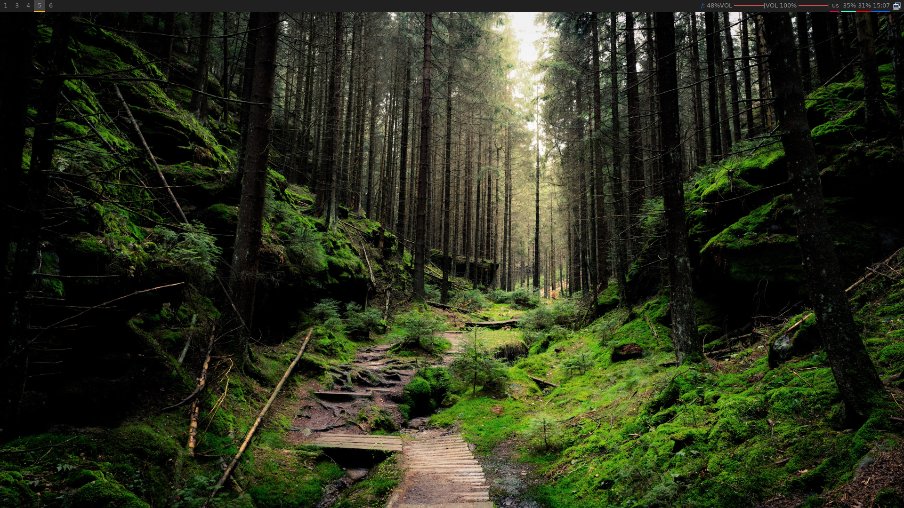

# Dotfiles 

Trying to save (again) my dotfiles for futures OS reinstall.

## Specs

* WM - i3-gaps
* Terminal - urxvt
* shell - zsh
    - oh-my-zsh with `lambda` theme

## Dependencies

- xclip 
- Rofi
- rxvt-unicode
- i3-gaps
- Iosevka fonts
- picom
- polybar
- neovim
- nitrogen

## Arch Linux command
> sudo pacman -S nitrogen neovim zsh xclip rofi rxvt-unicode i3-gaps ttc-iosevka polybar picom

# Screenshot

## TODO

- Configure polybar